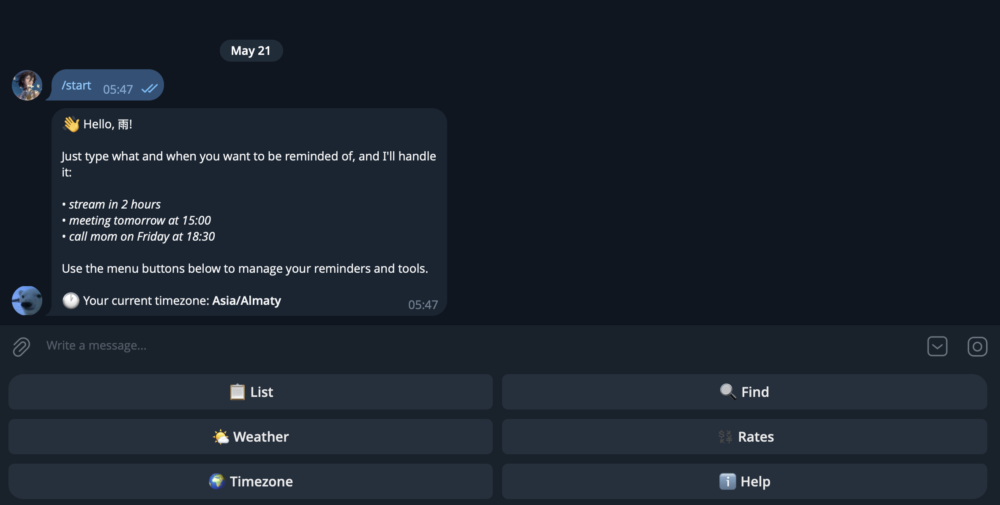
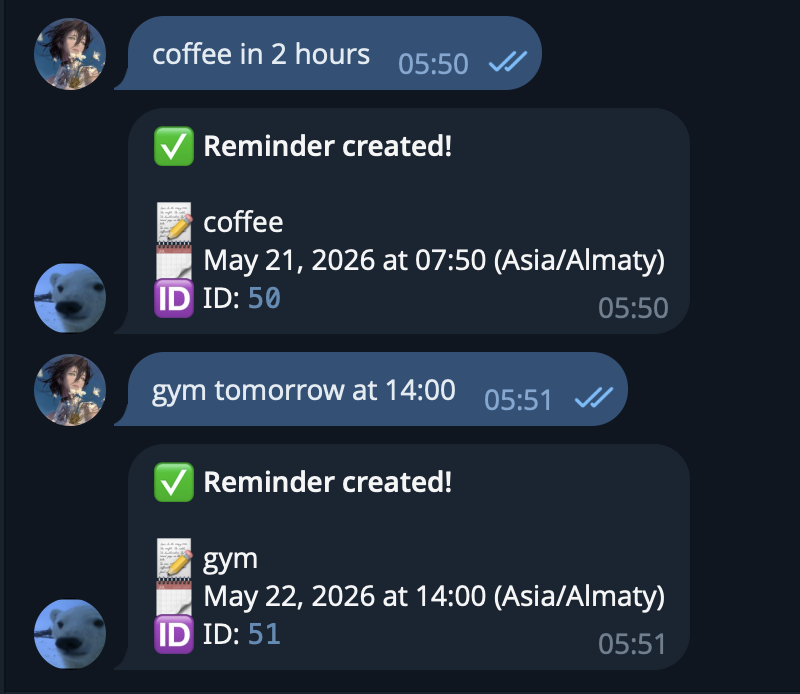
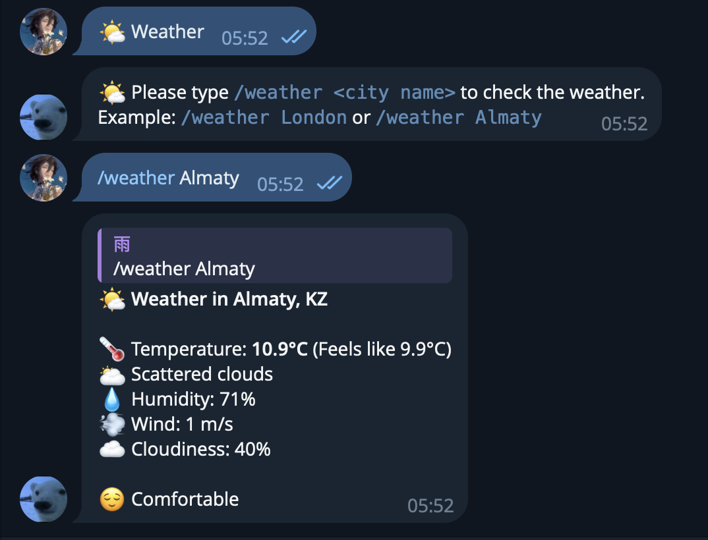
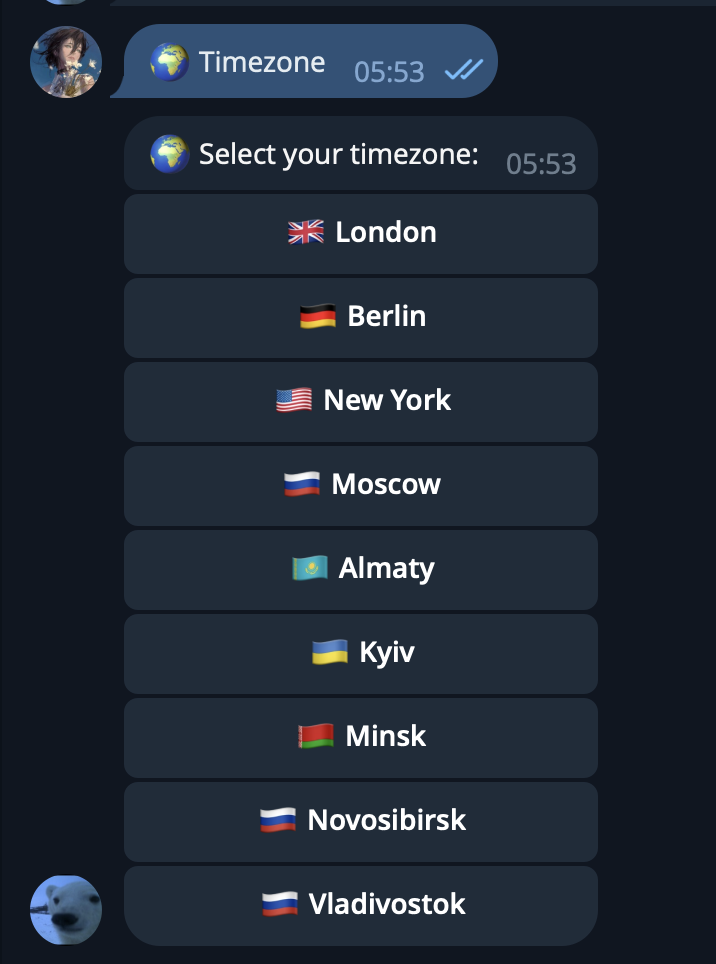
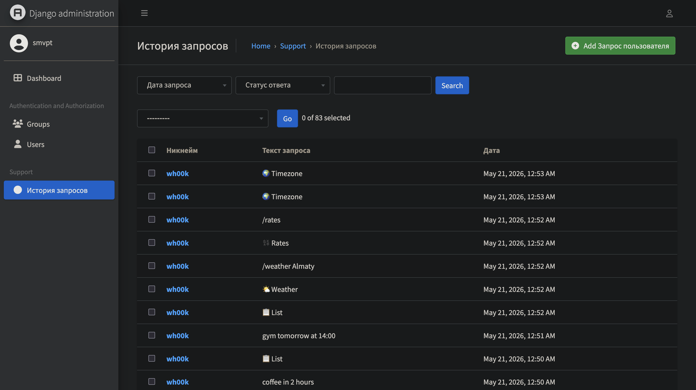

# Smart Reminder Telegram Bot

## Description
Smart Reminder Bot is a hybrid Telegram chatbot written in Python with a Django-based admin panel for reminder and database management.

The project allows users to create and manage reminders using natural language directly in Telegram. The system also includes additional tools such as weather information, exchange rates, reminder search, timezone management, and a Django admin interface.

Example requests:
- `meeting tomorrow at 15:00`
- `call mom in 2 hours`
- `workout friday at 18:30`
- `stream in 45 minutes`

---

# Technologies Used

- Python 3
- Django
- pyTelegramBotAPI
- SQLite
- requests
- BeautifulSoup4
- pytz
- threading
- regex
- OpenWeather API

---

# Main Features

## Telegram Chatbot
The bot supports:
- reminder creation
- reminder deletion
- reminder search
- natural language input
- timezone support
- weather information
- exchange rates
- error handling

---

## Django Admin Panel
The project includes a Django-based admin system for:
- database management
- reminder management
- user management
- administration tools

The Django structure contains:
- models
- views
- urls
- admin configuration
- SQLite integration

---

## Reminder System
Users can create reminders using natural language.

Examples:
- `meeting tomorrow at 10:00`
- `call mom friday at 18:00`
- `stream in 2 hours`
- `coffee in 30 minutes`

The bot automatically parses the text and schedules reminders.

---

## Reminder Search
The bot supports keyword and regex search.

Examples:
- `/find meeting`
- `/find workout`
- `/find \d{2}:\d{2}`

---

## Weather Information
Users can check the weather in any city.

Example:
- `/weather London`
- `/weather Almaty`

The bot uses the OpenWeather API.

---

## Exchange Rates
The bot displays current exchange rates from the National Bank of Kazakhstan.

Supported currencies:
- USD
- EUR
- RUB
- CNY

---

## Timezone Support
Users can select their timezone using inline buttons.

Supported examples:
- Almaty
- London
- Berlin
- Moscow
- New York

---

## Error Handling
The project handles:
- invalid input
- invalid regex
- API connection errors
- missing reminders
- unknown commands
- invalid city names
- timeout errors

---

# OOP Concepts Used

The project demonstrates:
- encapsulation
- inheritance
- polymorphism
- abstraction

Example classes:
- `ReminderBase`
- `SimpleReminder`
- `UrgentReminder`

---

# Algorithms Used

- Merge Sort for reminder sorting
- Regex pattern matching
- Natural language parsing
- Scheduler system for notifications

---

# Project Structure

```text
project/
├── adminpanel/
├── support/
├── screenshots/
├── bot.py
├── database.py
├── scheduler.py
├── nlp_parser.py
├── manage.py
├── requirements.txt
├── config.example.py
├── .gitignore
└── README.md
```

---

# Installation

## 1. Clone repository

```bash
git clone YOUR_GITHUB_LINK
cd project
```

---

## 2. Create virtual environment

### macOS / Linux
```bash
python3 -m venv venv
source venv/bin/activate
```

### Windows
```bash
python -m venv venv
venv\Scripts\activate
```

---

## 3. Install dependencies

```bash
pip install -r requirements.txt
```

---

# Configuration

Create a file named `config.py`

Example:

```python
BOT_TOKEN = "YOUR_BOT_TOKEN"
WEATHER_API = "YOUR_API_KEY"

DEFAULT_TIMEZONE = "Asia/Almaty"
DB_PATH = "reminders.db"
```

---

# Running the Telegram Bot

```bash
python bot.py
```

---

# Running Django Admin Panel

## Apply migrations

```bash
python manage.py migrate
```

## Create admin user

```bash
python manage.py createsuperuser
```

## Start Django server

```bash
python manage.py runserver
```

---

# Telegram Commands

| Command | Description |
|---|---|
| /start | Start the bot |
| /help | Show help |
| /list | Show reminders |
| /find | Search reminders |
| /weather | Show weather |
| /rates | Show exchange rates |
| /timezone | Change timezone |
| /cancel | Cancel current action |

---

# Screenshots

## Main Menu


## Reminder Creation


## Weather Feature


## Timezone Selection


## Django Admin Panel


---

# Security

Sensitive files are excluded from GitHub using `.gitignore`:
- `config.py`
- `reminders.db`
- `venv/`
- `__pycache__/`

---

# Author

Oleg Mukhin

